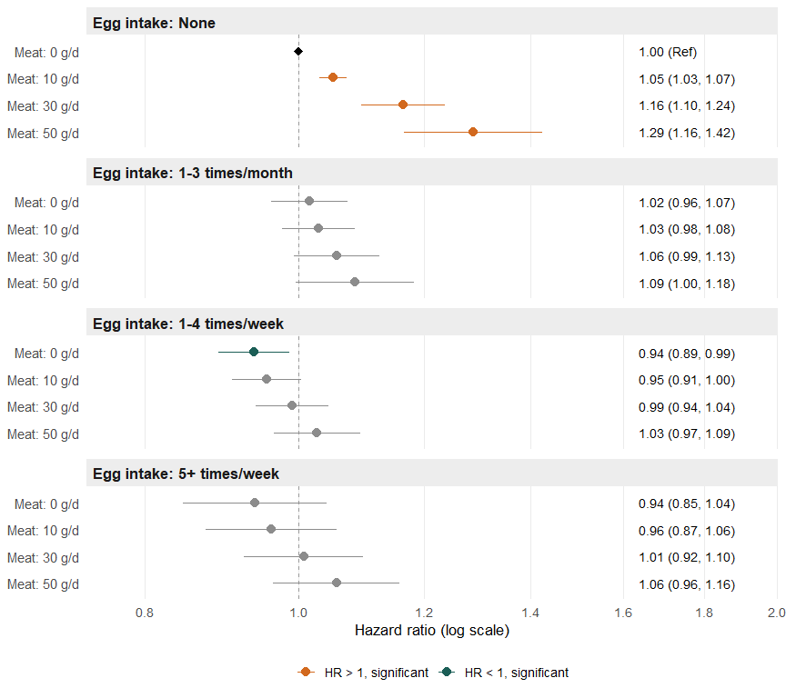
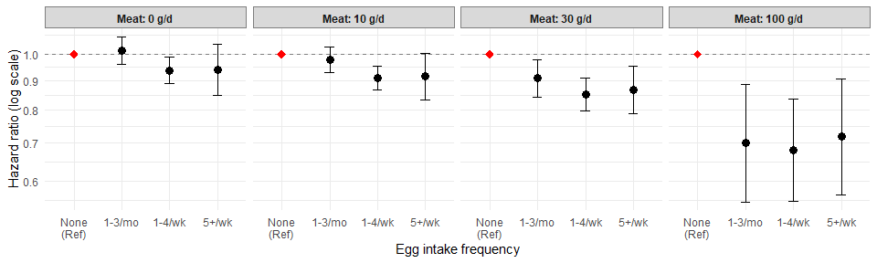
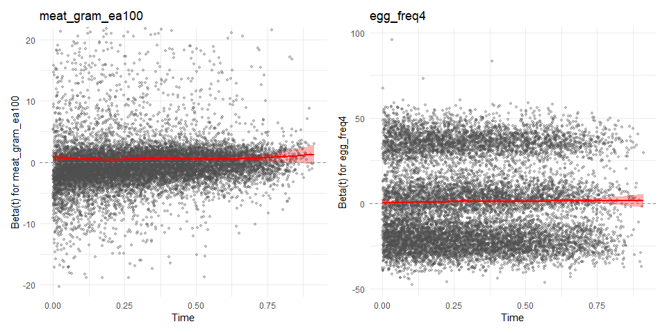

Egg composite CVD study
================

## Aim

- Examine associations between egg and meat intake and incident
  cardiovascular disease (CVD)
- Examine whether egg intake modifies the association between meat
  intake and CVD
  - i.e., whether egg and meat intake interact in their effect on CVD
    incidence

## Outcome

- Any of the following incident CVD cases:
  - Ischemic heart disease
  - Stroke/transient ischemic attack
  - Acute myocardial infarction
  - Congestive heart failure (in 27 chronic conditions) or heart failure
    and non-ischemic heart disease (in 30 chronic conditions)
  - Atrial fibrillation
- For disease definitions, see [Chronic Conditions Data
  Warehouse](https://www2.ccwdata.org/web/guest/condition-categories-chronic)
  - Note that the definitions may differ between 27 chronic conditions
    (available in 2008-2020 data) and 30 chronic conditions (2021-2022)

## Exposure of interest

- Dietary intake, measured via the AHS baseline questionnaire

- Egg intake frequency

  - Categorized into four groups based on frequency of intake

- Meat intake, gram/day

  - Energy-adjusted

- Multiplicative interaction terms between egg intake category and meat
  intake (g/d) were assessed in Cox proportional hazards models

## Datasets

- Medicare data, 2008-2022

  - For details regarding Medicare data, see [AHS-2 Medicare
    Linkage](https://github.com/keijioda/ahs_medicare_linkage/blob/main/summary.md)
    repository.

  - Master Beneficiary Summary File (MBSF), 2008-2022

    - Contains beneficiary characteristics and enrollment information

  - Chronic Conditions file (CC), 2008-2022

    - Contains the first occurrence date of [27 (or 30) specific chronic
      conditions](https://www2.ccwdata.org/web/guest/condition-categories-chronic)
    - Used to identify prevalent/incident cases of CVD and to identify
      comorbidities, based on ICD-9 and ICD-10 codes

  - Both files include n = 46,897 unique subjects across years, after
    excluding

    - Gender/DOB mismatch with AHS-2 data
    - Duplicate beneficiary IDs and SSNs

- AHS-2 baseline data: n = 96,144

- After merging Medicare and AHS-2 data, there were n = 43,467 subjects

  - Participants who opted out from the study or those who live outside
    the U.S. were already excluded at this point

## Inclusion/exclusion criteria

- Medicare beneficiaries who did not reach the age of 65 between 2008
  and 2022 (e.g., younger beneficiaries with disabilities or end-stage
  renal disease) were excluded (n = 1238), resulting in n = 42,229.

- n = 106 subjects with extreme BMI (\<16 or \>60), according to AHS
  questionnaire, were excluded, resulting n = 42,123.

- Unverified dates of deaths

  - Medicare data include a variable (`VALID_DEATH_DT_SW`) indicating
    whether a beneficiary’s day of death has been verified by the Social
    Security Administration or the Railroad Retirement Board.
  - There were 23 unverified death dates. Excluding these resulted in n
    = 42,100.

- Prevalent CVD cases

  - At this point of analysis, prevalent cases were defined as those who
    were diagnosed with any of the five CVD conditions prior to their
    AHS-2 enrollment
  - There were 3,542 such prevalent cases. Excluding these prevalen
    cases resulted in n = 38,558

## Multiple imputation

- For AHS-2 baseline data, including food-frequency questionnaire (FFQ),
  a guided multiple imputation was used to fill in missing data ([Fraser
  & Yan, 2007](https://pubmed.ncbi.nlm.nih.gov/17259903/))
  - Five imputed data sets were generated for subsequent analyses (See
    the analysis section for more details)
  - For descriptive analysis, we present results from the first imputed
    dataset

## Incident CVD cases

- Among n = 38,558 subjects, there were 12,890 incident CVD cases
  (33.4%)
  - Among these cases, there were 223 incident cases within 6 months
    after AHS-2 enrollment
  - Similarly, numbers of incident cases within 12, 18, 24, 36, and 48
    months are shown below:

| Months after enrollment | N incident CVD cases |
|------------------------:|---------------------:|
|                       6 |                  223 |
|                      12 |                  469 |
|                      18 |                  701 |
|                      24 |                  970 |
|                      36 |                 1415 |
|                      48 |                 1823 |

- For each of the five CVD conditions, the number of incident cases is
  shown below:

|                              | Overall     |
|:-----------------------------|:------------|
| n                            | 38558       |
| ISCHEMICHEART_EVER = Yes (%) | 7767 (20.1) |
| STROKE_TIA_EVER = Yes (%)    | 5101 (13.2) |
| AMI_EVER = Yes (%)           | 1297 ( 3.4) |
| CHF_EVER = Yes (%)           | 6075 (15.8) |
| ATRIAL_FIB_EVER = Yes (%)    | 5404 (14.0) |

- Many of these CVD cases have more than one of the 5 conditions. See
  below for the frequency table of CVD conditions:

| Number of CVD conditions |     n | Percent |
|-------------------------:|------:|--------:|
|                        0 | 25668 |   66.57 |
|                        1 |  5499 |   14.26 |
|                        2 |  3556 |    9.22 |
|                        3 |  2497 |    6.48 |
|                        4 |  1148 |    2.98 |
|                        5 |   190 |    0.49 |

## Descriptive tables

### Person-years of follow-up

| Statistic               |     Value |
|:------------------------|----------:|
| Total person-years      | 612479.78 |
| Follow-up years: Mean   |     15.88 |
| Follow-up years: Median |     17.90 |
| Follow-up years: SD     |      4.96 |

### Age at diagnosis of incident CVD cases

| Statistic                | Value |
|:-------------------------|:------|
| N                        | 12890 |
| Age at diagnosis: Mean   | 78.45 |
| Age at diagnosis: Median | 78.51 |
| Age at diagnosis: SD     | 8.32  |

### By cases/non-cases

|  | level | Overall | Non-case | Case | p | test |
|:---|:---|:---|:---|:---|:---|:---|
| n |  | 38558 | 25668 | 12890 |  |  |
| agecat (%) | 65-69 | 6175 (16.0) | 5648 (22.0) | 527 ( 4.1) | \<0.0001 |  |
|  | 70-74 | 6982 (18.1) | 5651 (22.0) | 1331 (10.3) |  |  |
|  | 75-79 | 6638 (17.2) | 4774 (18.6) | 1864 (14.5) |  |  |
|  | 80-84 | 5862 (15.2) | 3648 (14.2) | 2214 (17.2) |  |  |
|  | 85-89 | 4856 (12.6) | 2579 (10.0) | 2277 (17.7) |  |  |
|  | 90-94 | 3842 (10.0) | 1796 ( 7.0) | 2046 (15.9) |  |  |
|  | 95+ | 4203 (10.9) | 1572 ( 6.1) | 2631 (20.4) |  |  |
| bene_age_at_end_2022 (mean (SD)) |  | 80.92 (10.23) | 78.27 (9.41) | 86.21 (9.74) | \<0.0001 |  |
| bene_sex_F (%) | F | 24873 (64.5) | 17029 (66.3) | 7844 (60.9) | \<0.0001 |  |
|  | M | 13685 (35.5) | 8639 (33.7) | 5046 (39.1) |  |  |
| rti_race3 (%) | NH White | 28063 (72.8) | 17739 (69.1) | 10324 (80.1) | \<0.0001 |  |
|  | Black | 7706 (20.0) | 5755 (22.4) | 1951 (15.1) |  |  |
|  | Other | 2789 ( 7.2) | 2174 ( 8.5) | 615 ( 4.8) |  |  |
| marital (%) | Married | 28648 (74.3) | 19352 (75.4) | 9296 (72.1) | \<0.0001 |  |
|  | Never | 1421 ( 3.7) | 1006 ( 3.9) | 415 ( 3.2) |  |  |
|  | Div/Wid | 8489 (22.0) | 5310 (20.7) | 3179 (24.7) |  |  |
| educyou (%) | HSch & below | 7704 (20.0) | 4737 (18.5) | 2967 (23.0) | \<0.0001 |  |
|  | Some College | 15412 (40.0) | 10390 (40.5) | 5022 (39.0) |  |  |
|  | Bachelors + | 15442 (40.0) | 10541 (41.1) | 4901 (38.0) |  |  |
| vegstat (%) | Vegan | 3226 ( 8.4) | 2197 ( 8.6) | 1029 ( 8.0) | \<0.0001 |  |
|  | Lacto-ovo | 12259 (31.8) | 8046 (31.3) | 4213 (32.7) |  |  |
|  | Semi | 2132 ( 5.5) | 1346 ( 5.2) | 786 ( 6.1) |  |  |
|  | Pesco | 3681 ( 9.5) | 2509 ( 9.8) | 1172 ( 9.1) |  |  |
|  | Non-veg | 17260 (44.8) | 11570 (45.1) | 5690 (44.1) |  |  |
| bmicat (%) | Normal | 14905 (38.7) | 10351 (40.3) | 4554 (35.3) | \<0.0001 |  |
|  | Overweight | 13855 (35.9) | 9169 (35.7) | 4686 (36.4) |  |  |
|  | Obese | 9798 (25.4) | 6148 (24.0) | 3650 (28.3) |  |  |
| bmi (mean (SD)) |  | 27.32 (5.72) | 27.07 (5.58) | 27.82 (5.96) | \<0.0001 |  |
| exercise (%) | None | 7848 (20.4) | 4650 (18.1) | 3198 (24.8) | \<0.0001 |  |
|  | ≤0.5 hrs/wk | 9546 (24.8) | 6556 (25.5) | 2990 (23.2) |  |  |
|  | 0.5\<-2 hrs/wk | 10459 (27.1) | 7191 (28.0) | 3268 (25.4) |  |  |
|  | \>2 hrs/wk | 10705 (27.8) | 7271 (28.3) | 3434 (26.6) |  |  |
| sleephrs (%) | \<= 5 hrs | 3762 ( 9.8) | 2489 ( 9.7) | 1273 ( 9.9) | \<0.0001 |  |
|  | 6 hrs | 8474 (22.0) | 5755 (22.4) | 2719 (21.1) |  |  |
|  | 7 hrs | 14196 (36.8) | 9761 (38.0) | 4435 (34.4) |  |  |
|  | 8 hrs | 10107 (26.2) | 6448 (25.1) | 3659 (28.4) |  |  |
|  | \>= 9 hrs | 2019 ( 5.2) | 1215 ( 4.7) | 804 ( 6.2) |  |  |
| smokecat6 (%) | A_Never | 30781 (79.8) | 20650 (80.5) | 10131 (78.6) | \<0.0001 |  |
|  | B_QuitYrs30Plus | 2965 ( 7.7) | 1717 ( 6.7) | 1248 ( 9.7) |  |  |
|  | C_QuitYrs21To30 | 2084 ( 5.4) | 1433 ( 5.6) | 651 ( 5.1) |  |  |
|  | D_QuitYrs11To20 | 1387 ( 3.6) | 942 ( 3.7) | 445 ( 3.5) |  |  |
|  | E_QuitYrs6To10 | 520 ( 1.3) | 358 ( 1.4) | 162 ( 1.3) |  |  |
|  | F_QuitYrsLesOneTo5YearsNcur | 821 ( 2.1) | 568 ( 2.2) | 253 ( 2.0) |  |  |
| alccat (%) | Never | 36543 (94.8) | 24205 (94.3) | 12338 (95.7) | \<0.0001 |  |
|  | Current | 2015 ( 5.2) | 1463 ( 5.7) | 552 ( 4.3) |  |  |
| como_depress (%) | No | 38215 (99.1) | 25579 (99.7) | 12636 (98.0) | \<0.0001 |  |
|  | Yes | 343 ( 0.9) | 89 ( 0.3) | 254 ( 2.0) |  |  |
| como_disab (%) | No | 35429 (91.9) | 24881 (96.9) | 10548 (81.8) | \<0.0001 |  |
|  | Yes | 3129 ( 8.1) | 787 ( 3.1) | 2342 (18.2) |  |  |
| como_diabetes (%) | No | 37953 (98.4) | 25539 (99.5) | 12414 (96.3) | \<0.0001 |  |
|  | Yes | 605 ( 1.6) | 129 ( 0.5) | 476 ( 3.7) |  |  |
| como_hypert (%) | No | 36711 (95.2) | 25273 (98.5) | 11438 (88.7) | \<0.0001 |  |
|  | Yes | 1847 ( 4.8) | 395 ( 1.5) | 1452 (11.3) |  |  |
| como_hyperl (%) | No | 37102 (96.2) | 25323 (98.7) | 11779 (91.4) | \<0.0001 |  |
|  | Yes | 1456 ( 3.8) | 345 ( 1.3) | 1111 ( 8.6) |  |  |
| como_resp (%) | No | 38172 (99.0) | 25580 (99.7) | 12592 (97.7) | \<0.0001 |  |
|  | Yes | 386 ( 1.0) | 88 ( 0.3) | 298 ( 2.3) |  |  |
| como_anemia (%) | No | 37574 (97.4) | 25453 (99.2) | 12121 (94.0) | \<0.0001 |  |
|  | Yes | 984 ( 2.6) | 215 ( 0.8) | 769 ( 6.0) |  |  |
| como_kidney (%) | No | 38448 (99.7) | 25645 (99.9) | 12803 (99.3) | \<0.0001 |  |
|  | Yes | 110 ( 0.3) | 23 ( 0.1) | 87 ( 0.7) |  |  |
| como_hypoth (%) | No | 37849 (98.2) | 25518 (99.4) | 12331 (95.7) | \<0.0001 |  |
|  | Yes | 709 ( 1.8) | 150 ( 0.6) | 559 ( 4.3) |  |  |
| como_cancers (%) | No | 38127 (98.9) | 25566 (99.6) | 12561 (97.4) | \<0.0001 |  |
|  | Yes | 431 ( 1.1) | 102 ( 0.4) | 329 ( 2.6) |  |  |
| egg_freq4 (%) | Never | 10295 (26.7) | 6814 (26.5) | 3481 (27.0) | 0.1630 |  |
|  | 1-3/mo | 9952 (25.8) | 6670 (26.0) | 3282 (25.5) |  |  |
|  | 1-4/wk | 16123 (41.8) | 10767 (41.9) | 5356 (41.6) |  |  |
|  | 5+/wk | 2188 ( 5.7) | 1417 ( 5.5) | 771 ( 6.0) |  |  |
| meat_gram_ea (mean (SD)) |  | 15.13 (26.55) | 15.40 (26.65) | 14.58 (26.34) | 0.0043 |  |
| fish_gram_ea (mean (SD)) |  | 9.23 (16.20) | 9.62 (16.93) | 8.46 (14.61) | \<0.0001 |  |
| alldairy2_gram_ea (mean (SD)) |  | 147.42 (185.21) | 144.52 (184.63) | 153.19 (186.23) | \<0.0001 |  |
| totalveg_gram_ea (mean (SD)) |  | 300.98 (178.87) | 300.70 (178.82) | 301.54 (178.98) | 0.6648 |  |
| fruits_gram_ea (mean (SD)) |  | 319.04 (222.07) | 317.87 (223.73) | 321.35 (218.73) | 0.1463 |  |
| refgrains_gram_ea (mean (SD)) |  | 114.92 (115.50) | 119.22 (117.30) | 106.37 (111.34) | \<0.0001 |  |
| whole_mixed_grains_gram_ea (mean (SD)) |  | 252.65 (187.68) | 248.28 (186.06) | 261.33 (190.58) | \<0.0001 |  |
| nutsseeds_gram_ea (mean (SD)) |  | 23.09 (20.08) | 22.52 (19.73) | 24.23 (20.72) | \<0.0001 |  |
| legumes_gram_ea (mean (SD)) |  | 77.77 (69.21) | 78.73 (70.21) | 75.84 (67.14) | 0.0001 |  |

## Cox proportional hazards models

- To examine risk factors associated with incident CVD, we employed the
  Cox proportional hazards model with attained age as the time scale

  - Age at entry was calculated based on the return date of AHS-2
    questionnaire
  - Those who died during the follow-up were censored at the date of
    death verified in Medicare data
  - Those who were diagnosed with any of the CVD conditions after study
    enrollment were identified as incident cases and their age at
    diagnosis was calculated
  - The main exposure variable of interest was the frequency of egg
    intake.
    - In the AHS-2 baseline questionnaire, the frequency of egg intake
      was measured in 9 categories
    - Based on its distribution, egg frequency was re-categorized into 4
      groups (see the “Descriptive table” section)
  - For meat and other food group variables, their intake was calculated
    in gram per day and then energy-adjusted by the residual method

- Other than egg frequency (4 levels), meat intake (gram/day,
  energy-adjusted), and egg x meat interaction, the Cox model includes:

  - Demographics:
    - From Medicare data: Sex, RTI race
    - From AHS-2 baseline questionnaire: Marital status, educational
      level
  - Lifestyles: BMI category, exercise, sleep hours, smoking status,
    alcohol use
  - Dietary intake:
    - Total energy intake (kcal/day)
    - Fish intake (gram/day, energy-adjusted)
    - Dairy intake (gram/day, energy-adjusted)
    - Total vegetable intake (gram/day, energy-adjusted)
    - Fruit intake (gram/day, energy-adjusted)
    - Refined grain intake (gram/day, energy-adjusted)
    - Whole/mixed grain intake (gram/day, energy-adjusted)
    - Nuts/seeds intake (gram/day, energy-adjusted)
    - Legume intake (gram/day, energy-adjusted)
  - Comorbidity (from Medicare data)
    - Depression
    - Functional disabilities (cataract, glaucoma, hip fracture,
      osteoporosis, rheumatoid arthritis/osteoarthritis)
    - Diabetes
    - Hyperlipidemia
    - Respiratory diseases (COPD, asthma)
    - Anemia
    - Chronic kidney diseases
    - Hypothyroidism
    - Cancers (breast, colorectal, prostate, lung, endometrial)

- The models were run for each of the imputed data sets, yielding 5 sets
  of estimated beta coefficients and their variance-covariance matrix

  - These results were combined according to Rubin’s rules, and the
    pooled estimates of HRs and their 95% confidence intervals were
    produced

- The proportional hazards assumption was assessed by plotting scaled
  Schoenfeld residuals against time for each covariate. The residuals
  scattered randomly around zero with no discernible trend over time,
  supporting the assumption (see results below)

- All analyses were performed in R version 4.6.1

### Hazard ratios for variables other than egg and meat intake

- In the Cox model, the interaction between egg frequency and meat
  intake was statistically significant (p = 0.018)

- See the estimated hazard ratios for variables other than egg and meat
  intake

  - Note that the reference levels are omitted in the table below

| Variable | Level | HR | p.value |
|:---|:---|:---|:---|
| bene_sex_F | M | 1.28 (1.23, 1.33) | \<.0001 |
| rti_race3 | Black | 0.77 (0.72, 0.81) | \<.0001 |
| rti_race3 | Other | 0.75 (0.69, 0.81) | \<.0001 |
| marital | Never | 1.15 (1.04, 1.27) | 0.0061 |
| marital | Div/Wid | 0.98 (0.94, 1.03) | 0.5083 |
| educyou2 | HSch & below | 0.88 (0.84, 0.92) | \<.0001 |
| educyou2 | Some College | 0.94 (0.90, 0.98) | 0.0017 |
| bmicat | Overweight | 1.13 (1.09, 1.18) | \<.0001 |
| bmicat | Obese | 1.59 (1.51, 1.67) | \<.0001 |
| exercise | ≤0.5 hrs/wk | 0.99 (0.94, 1.04) | 0.5692 |
| exercise | 0.5\<-2 hrs/wk | 0.96 (0.92, 1.01) | 0.1573 |
| exercise | \>2 hrs/wk | 0.93 (0.89, 0.98) | 0.0096 |
| sleephrs2 | \<= 5 hrs | 1.21 (1.13, 1.29) | \<.0001 |
| sleephrs2 | 6 hrs | 1.08 (1.03, 1.13) | 0.0030 |
| sleephrs2 | 8 hrs | 1.06 (1.02, 1.11) | 0.0082 |
| sleephrs2 | \>= 9 hrs | 1.09 (1.01, 1.18) | 0.0226 |
| smokecat6 | B_QuitYrs30Plus | 0.93 (0.87, 0.99) | 0.0173 |
| smokecat6 | C_QuitYrs21To30 | 1.24 (1.13, 1.35) | \<.0001 |
| smokecat6 | D_QuitYrs11To20 | 1.31 (1.19, 1.45) | \<.0001 |
| smokecat6 | E_QuitYrs6To10 | 1.55 (1.32, 1.82) | \<.0001 |
| smokecat6 | F_QuitYrsLesOneTo5YearsNcur | 1.72 (1.50, 1.97) | \<.0001 |
| alccat | Current | 0.99 (0.91, 1.09) | 0.9034 |
| kcal100 |  | 1.00 (1.00, 1.00) | 0.0642 |
| fish_gram_ea100 |  | 0.96 (0.84, 1.09) | 0.5532 |
| alldairy2_gram_ea100 |  | 0.99 (0.98, 1.00) | 0.0133 |
| totalveg_gram_ea100 |  | 1.01 (1.00, 1.02) | 0.0645 |
| fruits_gram_ea100 |  | 0.99 (0.98, 1.00) | 0.0219 |
| refgrains_gram_ea100 |  | 1.00 (0.99, 1.02) | 0.5725 |
| whole_mixed_grains_gram_ea100 |  | 1.00 (0.99, 1.01) | 0.5529 |
| nutsseeds_gram_ea100 |  | 0.89 (0.82, 0.98) | 0.0164 |
| legumes_gram_ea100 |  | 1.02 (0.99, 1.05) | 0.1290 |
| como_depress | Yes | 1.14 (1.00, 1.30) | 0.0475 |
| como_disab | Yes | 2.00 (1.88, 2.14) | \<.0001 |
| como_diabetes | Yes | 1.49 (1.35, 1.65) | \<.0001 |
| como_hyperl | Yes | 1.24 (1.15, 1.35) | \<.0001 |
| como_resp | Yes | 1.31 (1.16, 1.48) | \<.0001 |
| como_anemia | Yes | 1.29 (1.18, 1.40) | \<.0001 |
| como_kidney | Yes | 1.26 (1.02, 1.57) | 0.0351 |
| como_hypoth | Yes | 1.25 (1.13, 1.37) | \<.0001 |
| como_cancers | Yes | 1.19 (1.06, 1.34) | 0.0028 |

### Hazard ratios for the joint effect of egg and meat intake

- One way to illustrate the negative interaction between egg and meat
  intake is to calculate hazard ratios for each egg intake group at
  representative levels of meat intake. We chose meat intakes of 0, 10,
  30, and 100 grams/day and estimated HRs for all egg × meat
  combinations, using “no egg intake and no meat intake” as the
  reference group. These HRs reflect the joint risk of egg and meat
  intake combined, relative to this “healthiest” reference group (no
  eggs, no meat).
  - The HRs are shown in the table below
  - Trend p-values for egg frequency, calculated at each level of meat
    intake, are shown in the last column of the table
  - Trend p-values for meat intake, calculated within each egg frequency
    group, are shown in the last row of the table

<table class="table" style="color: black; width: auto !important; margin-left: auto; margin-right: auto;">

<thead>

<tr>

<th style="empty-cells: hide;border-bottom:hidden;" colspan="1">

</th>

<th style="border-bottom:hidden;padding-bottom:0; padding-left:3px;padding-right:3px;text-align: center; " colspan="4">

Egg frequency

</th>

<th style="empty-cells: hide;border-bottom:hidden;" colspan="1">

</th>

</tr>

<tr>

<th style="text-align:left;">

Meat intake (g/day)
</th>

<th style="text-align:center;">

None
</th>

<th style="text-align:center;">

1-3/mo
</th>

<th style="text-align:center;">

1-4/wk
</th>

<th style="text-align:center;">

5+/wk
</th>

<th style="text-align:center;">

P-trend (egg)
</th>

</tr>

</thead>

<tbody>

<tr>

<td style="text-align:left;">

0
</td>

<td style="text-align:center;">

1.00 (Ref)
</td>

<td style="text-align:center;">

1.02 (0.96, 1.07)
</td>

<td style="text-align:center;">

0.94 (0.89, 0.99)
</td>

<td style="text-align:center;">

0.94 (0.85, 1.04)
</td>

<td style="text-align:center;">

0.0065
</td>

</tr>

<tr>

<td style="text-align:left;">

10
</td>

<td style="text-align:center;">

1.05 (1.03, 1.07)
</td>

<td style="text-align:center;">

1.03 (0.98, 1.08)
</td>

<td style="text-align:center;">

0.95 (0.91, 1.00)
</td>

<td style="text-align:center;">

0.96 (0.87, 1.06)
</td>

<td style="text-align:center;">

0.0005
</td>

</tr>

<tr>

<td style="text-align:left;">

30
</td>

<td style="text-align:center;">

1.16 (1.10, 1.24)
</td>

<td style="text-align:center;">

1.06 (0.99, 1.13)
</td>

<td style="text-align:center;">

0.99 (0.94, 1.04)
</td>

<td style="text-align:center;">

1.01 (0.92, 1.10)
</td>

<td style="text-align:center;">

0.0002
</td>

</tr>

<tr>

<td style="text-align:left;">

100
</td>

<td style="text-align:center;">

1.66 (1.36, 2.03)
</td>

<td style="text-align:center;">

1.16 (0.99, 1.36)
</td>

<td style="text-align:center;">

1.13 (1.02, 1.25)
</td>

<td style="text-align:center;">

1.19 (1.03, 1.38)
</td>

<td style="text-align:center;">

0.0205
</td>

</tr>

<tr>

<td style="text-align:left;">

P-trend (meat)
</td>

<td style="text-align:center;">

\<0.0001
</td>

<td style="text-align:center;">

0.1268
</td>

<td style="text-align:center;">

0.0005
</td>

<td style="text-align:center;">

0.0085
</td>

<td style="text-align:center;">

</td>

</tr>

</tbody>

</table>

- Shown below is a forest plot depicting the HRs for egg × meat
  combinations:

<!-- -->

### Hazard ratios for egg frequency estimated at different meat intake level

- Another way to illustrate the egg x meat interaction, and one that
  isolates the egg effect more directly, is to calculate hazard ratios
  for egg frequency at each level of meat intake. For meat intakes of 0,
  10, 30, and 100 grams/day, we separately estimated HRs for egg
  frequency groups, using “no egg intake” as the reference at each meat
  level. These HRs show how the association between egg intake and CVD
  risk is modified by meat intake

<table class="table" style="color: black; width: auto !important; margin-left: auto; margin-right: auto;">

<thead>

<tr>

<th style="empty-cells: hide;border-bottom:hidden;" colspan="1">

</th>

<th style="border-bottom:hidden;padding-bottom:0; padding-left:3px;padding-right:3px;text-align: center; " colspan="4">

Egg frequency

</th>

<th style="empty-cells: hide;border-bottom:hidden;" colspan="1">

</th>

</tr>

<tr>

<th style="text-align:left;">

Meat intake (gram/day)
</th>

<th style="text-align:center;">

None
</th>

<th style="text-align:center;">

1-3 times/month
</th>

<th style="text-align:center;">

1-4 times/week
</th>

<th style="text-align:center;">

5+ times/week
</th>

<th style="text-align:center;">

P-trend
</th>

</tr>

</thead>

<tbody>

<tr>

<td style="text-align:left;">

0
</td>

<td style="text-align:center;">

1.00 (Ref)
</td>

<td style="text-align:center;">

1.02 (0.96, 1.07)
</td>

<td style="text-align:center;">

0.94 (0.89, 0.99)
</td>

<td style="text-align:center;">

0.94 (0.85, 1.04)
</td>

<td style="text-align:center;">

0.0065
</td>

</tr>

<tr>

<td style="text-align:left;">

10
</td>

<td style="text-align:center;">

1.00 (Ref)
</td>

<td style="text-align:center;">

0.98 (0.93, 1.03)
</td>

<td style="text-align:center;">

0.91 (0.86, 0.95)
</td>

<td style="text-align:center;">

0.91 (0.83, 1.00)
</td>

<td style="text-align:center;">

0.0005
</td>

</tr>

<tr>

<td style="text-align:left;">

30
</td>

<td style="text-align:center;">

1.00 (Ref)
</td>

<td style="text-align:center;">

0.91 (0.84, 0.98)
</td>

<td style="text-align:center;">

0.85 (0.80, 0.91)
</td>

<td style="text-align:center;">

0.87 (0.79, 0.95)
</td>

<td style="text-align:center;">

0.0002
</td>

</tr>

<tr>

<td style="text-align:left;">

100
</td>

<td style="text-align:center;">

1.00 (Ref)
</td>

<td style="text-align:center;">

0.70 (0.55, 0.89)
</td>

<td style="text-align:center;">

0.68 (0.55, 0.83)
</td>

<td style="text-align:center;">

0.72 (0.57, 0.90)
</td>

<td style="text-align:center;">

0.0205
</td>

</tr>

</tbody>

</table>

<!-- -->

## Substitution analysis

- Substitution analysis was conducted to estimate the isocaloric effect
  of replacing another dietary component with egg intake, holding total
  energy intake constant, rather than assuming increased egg consumption
  occurs independent of overall diet composition
  - Substitutions were modeled for two different comparator foods,
    legumes and nuts/seeds, to assess whether the egg–meat interaction
    on CVD risk was sensitive to the specific food displaced
  - The substitution amount for each comparator food was defined as the
    quantity isocaloric with one egg, corresponding to approximately 60
    g of legumes and 14 g of nuts/seeds based on their respective energy
    densities
    - These gram-equivalents were then scaled by the frequency of egg
      consumption within each exposure category to obtain a daily
      gram-equivalent quantity of the comparator food displaced.
- Substitution HRs for egg intake across levels of meat consumption were
  similar regardless of the specific comparator food (legumes or
  nuts/seeds), suggesting that the observed interaction between egg and
  meat intake on CVD risk is not sensitive to the choice of displaced
  dietary component.

<table class="table" style="color: black; width: auto !important; margin-left: auto; margin-right: auto;">

<thead>

<tr>

<th style="empty-cells: hide;border-bottom:hidden;" colspan="1">

</th>

<th style="border-bottom:hidden;padding-bottom:0; padding-left:3px;padding-right:3px;text-align: center; " colspan="4">

Egg frequency (substituted for legumes)

</th>

</tr>

<tr>

<th style="text-align:left;">

Meat intake (g/day)
</th>

<th style="text-align:center;">

None
</th>

<th style="text-align:center;">

1-3/mo
</th>

<th style="text-align:center;">

1-4/wk
</th>

<th style="text-align:center;">

5+/wk
</th>

</tr>

</thead>

<tbody>

<tr>

<td style="text-align:left;">

0
</td>

<td style="text-align:center;">

1.00 (Ref)
</td>

<td style="text-align:center;">

1.02 (0.96, 1.07)
</td>

<td style="text-align:center;">

0.93 (0.89, 0.98)
</td>

<td style="text-align:center;">

0.93 (0.84, 1.03)
</td>

</tr>

<tr>

<td style="text-align:left;">

10
</td>

<td style="text-align:center;">

1.00 (Ref)
</td>

<td style="text-align:center;">

0.98 (0.93, 1.03)
</td>

<td style="text-align:center;">

0.90 (0.86, 0.95)
</td>

<td style="text-align:center;">

0.90 (0.82, 0.99)
</td>

</tr>

<tr>

<td style="text-align:left;">

30
</td>

<td style="text-align:center;">

1.00 (Ref)
</td>

<td style="text-align:center;">

0.91 (0.84, 0.98)
</td>

<td style="text-align:center;">

0.85 (0.79, 0.91)
</td>

<td style="text-align:center;">

0.85 (0.78, 0.94)
</td>

</tr>

<tr>

<td style="text-align:left;">

100
</td>

<td style="text-align:center;">

1.00 (Ref)
</td>

<td style="text-align:center;">

0.70 (0.55, 0.89)
</td>

<td style="text-align:center;">

0.68 (0.55, 0.83)
</td>

<td style="text-align:center;">

0.71 (0.56, 0.89)
</td>

</tr>

</tbody>

</table>

<table class="table" style="color: black; width: auto !important; margin-left: auto; margin-right: auto;">

<thead>

<tr>

<th style="empty-cells: hide;border-bottom:hidden;" colspan="1">

</th>

<th style="border-bottom:hidden;padding-bottom:0; padding-left:3px;padding-right:3px;text-align: center; " colspan="4">

Egg frequency (substituted for nuts/seeds)

</th>

</tr>

<tr>

<th style="text-align:left;">

Meat intake (g/day)
</th>

<th style="text-align:center;">

None
</th>

<th style="text-align:center;">

1-3/mo
</th>

<th style="text-align:center;">

1-4/wk
</th>

<th style="text-align:center;">

5+/wk
</th>

</tr>

</thead>

<tbody>

<tr>

<td style="text-align:left;">

0
</td>

<td style="text-align:center;">

1.00 (Ref)
</td>

<td style="text-align:center;">

1.02 (0.96, 1.07)
</td>

<td style="text-align:center;">

0.94 (0.90, 0.99)
</td>

<td style="text-align:center;">

0.95 (0.86, 1.06)
</td>

</tr>

<tr>

<td style="text-align:left;">

10
</td>

<td style="text-align:center;">

1.00 (Ref)
</td>

<td style="text-align:center;">

0.98 (0.93, 1.03)
</td>

<td style="text-align:center;">

0.91 (0.87, 0.96)
</td>

<td style="text-align:center;">

0.93 (0.84, 1.02)
</td>

</tr>

<tr>

<td style="text-align:left;">

30
</td>

<td style="text-align:center;">

1.00 (Ref)
</td>

<td style="text-align:center;">

0.91 (0.84, 0.98)
</td>

<td style="text-align:center;">

0.86 (0.80, 0.92)
</td>

<td style="text-align:center;">

0.88 (0.80, 0.97)
</td>

</tr>

<tr>

<td style="text-align:left;">

100
</td>

<td style="text-align:center;">

1.00 (Ref)
</td>

<td style="text-align:center;">

0.70 (0.55, 0.89)
</td>

<td style="text-align:center;">

0.68 (0.56, 0.84)
</td>

<td style="text-align:center;">

0.73 (0.58, 0.92)
</td>

</tr>

</tbody>

</table>

## Sensitivity analysis

- A sensitivity analysis was also conducted as follows:
  - We applied a two-year lag window following study entry,
    reclassifying subjects flagged with any of the five CVD conditions
    within that window from incident to prevalent and excluding them
    from the at-risk population.
  - To avoid immortal time bias introduced by this post-entry exclusion,
    the time origin of the Cox model was shifted to two years after
    study entry.
- In this sensitivity analysis, the interaction between egg frequency
  and meat intake remained statistically significant (p = 0.035).
  - Estimated HRs for egg frequency at the same levels of meat intake
    are shown below. The results were similar to those from the main
    analysis.

<table class="table" style="color: black; width: auto !important; margin-left: auto; margin-right: auto;">

<thead>

<tr>

<th style="empty-cells: hide;border-bottom:hidden;" colspan="1">

</th>

<th style="border-bottom:hidden;padding-bottom:0; padding-left:3px;padding-right:3px;text-align: center; " colspan="4">

Egg frequency

</th>

<th style="empty-cells: hide;border-bottom:hidden;" colspan="1">

</th>

</tr>

<tr>

<th style="text-align:left;">

Meat intake (gram/day)
</th>

<th style="text-align:center;">

None
</th>

<th style="text-align:center;">

1-3 times/month
</th>

<th style="text-align:center;">

1-4 times/week
</th>

<th style="text-align:center;">

5+ times/week
</th>

<th style="text-align:center;">

P-trend
</th>

</tr>

</thead>

<tbody>

<tr>

<td style="text-align:left;">

0
</td>

<td style="text-align:center;">

1.00 (Ref)
</td>

<td style="text-align:center;">

1.04 (0.98, 1.10)
</td>

<td style="text-align:center;">

0.94 (0.89, 1.00)
</td>

<td style="text-align:center;">

0.93 (0.84, 1.04)
</td>

<td style="text-align:center;">

0.0112
</td>

</tr>

<tr>

<td style="text-align:left;">

10
</td>

<td style="text-align:center;">

1.00 (Ref)
</td>

<td style="text-align:center;">

1.00 (0.95, 1.05)
</td>

<td style="text-align:center;">

0.91 (0.87, 0.96)
</td>

<td style="text-align:center;">

0.91 (0.83, 1.00)
</td>

<td style="text-align:center;">

0.0012
</td>

</tr>

<tr>

<td style="text-align:left;">

30
</td>

<td style="text-align:center;">

1.00 (Ref)
</td>

<td style="text-align:center;">

0.92 (0.85, 0.99)
</td>

<td style="text-align:center;">

0.85 (0.80, 0.92)
</td>

<td style="text-align:center;">

0.86 (0.78, 0.95)
</td>

<td style="text-align:center;">

0.0005
</td>

</tr>

<tr>

<td style="text-align:left;">

100
</td>

<td style="text-align:center;">

1.00 (Ref)
</td>

<td style="text-align:center;">

0.68 (0.53, 0.87)
</td>

<td style="text-align:center;">

0.68 (0.55, 0.84)
</td>

<td style="text-align:center;">

0.72 (0.57, 0.91)
</td>

<td style="text-align:center;">

0.0283
</td>

</tr>

</tbody>

</table>

## Assumption checking

### Checking the linearity of dietary variables

- To examine whether the associations between meat and other dietary
  intakes and log hazard were linear, we fit Cox models using restricted
  cubic splines with 4 knots for each energy-adjusted dietary variable
  (grams/day). None of the dietary variables showed a significant
  nonlinear association with incident CVD, except for fruit intake (p =
  0.0290).

| variable                   | chisq |  df | p_nonlinear |
|:---------------------------|------:|----:|------------:|
| meat_gram_ea               |  4.16 |   2 |      0.1249 |
| fish_gram_ea               |  2.30 |   2 |      0.3161 |
| alldairy2_gram_ea          |  0.59 |   2 |      0.7458 |
| totalveg_gram_ea           |  5.78 |   2 |      0.0556 |
| fruits_gram_ea             |  7.08 |   2 |      0.0290 |
| refgrains_gram_ea          |  0.03 |   2 |      0.9841 |
| whole_mixed_grains_gram_ea |  1.34 |   2 |      0.5107 |
| nutsseeds_gram_ea          |  4.77 |   2 |      0.0920 |
| legumes_gram_ea            |  0.26 |   2 |      0.8797 |

### Checking the proportional hazards assumption

- The proportional hazards assumption was assessed by plotting scaled
  Schoenfeld residuals against time for each covariate. The residuals
  scattered randomly around zero with no discernible trend over time,
  supporting the assumption

<!-- -->

    ## Warning in Surv(agein + 2, ageout, inc_CVD): Stop time must be > start time, NA
    ## created

<!-- -->
